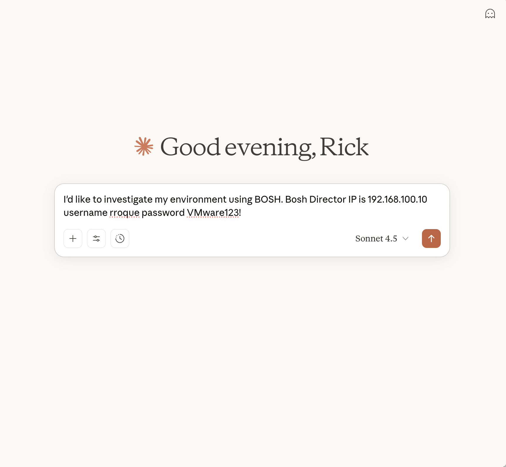

# BOSH MCP Server

A BOSH MCP Server written in Python.  It exposes only two tools, bosh_director_login and execute_bosh_command.  The LLM does the rest!


Note:
- The MCP server is configured to use SSE
- Container for the MCP Server can be found [here](https://hub.docker.com/r/rroque99/bosh-mcp).


## Running the MCP Server

You can run the MCP server using [uv](https://docs.astral.sh/uv/getting-started/installation/) or you can deploy it using docker or pushing the container to Tanzu Platform.

**UV**
```bash
foo@bar:~$ uv run src/main.py
INFO:     Started server process [10]
INFO:     Waiting for application startup.
INFO:     Application startup complete.
INFO:     Uvicorn running on http://0.0.0.0:80 (Press CTRL+C to quit)
```

**Docker**
```bash
foo@bar:~$ docker run --rm -p 80:80 rroque99/bosh-mcp:latest
INFO:     Started server process [10]
INFO:     Waiting for application startup.
INFO:     Application startup complete.
INFO:     Uvicorn running on http://0.0.0.0:80 (Press CTRL+C to quit)
```


**Tanzu Platform(CF)**
```bash
foo@bar:~$ cf push bosh-mcp --docker-image rroque99/bosh-mcp:latest
```

## Configuring Claude Desktop

This MCP server doesn't currently support OAUTH so using Claude Desktop with this MCP Server requires mcp-proxy, which can be found [here](https://github.com/sparfenyuk/mcp-proxy).  Mcp-proxy is a tool that switches between server transports, so in this case STDIO to SSE.  After installing mcp-proxy setup Local MCP Servers in Claude Desktop as follows:

```bash
{
    "mcpServers": {
        "Bosh-mcp": {
            "command": "<path-to-mcp-proxy>",
            "args": [
                "http://<IP or FQDN for BOSH mcp>/sse"
            ]
        }
    }
}
```

## Example Prompt

Below is an example prompt to get things going.  It's understandable that we shouldn't be passing usernames and passwords into a prompt however this is currently a proof of concept until OAUTH is fully supported



