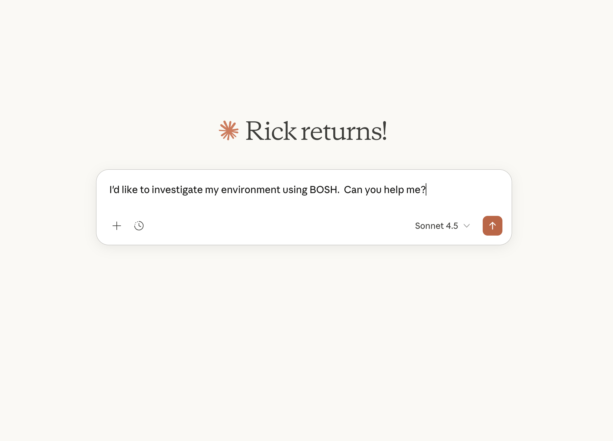

# BOSH MCP Server

This BOSH MCP Server is written in Python.  It exposes only two tools, bosh_director_login and execute_bosh_command.  The LLM does the rest!

A BOSH MCP Server can be very helpful in troubleshooting and analyzing Tanzu Platform however it can also be very dangerous and perform unexpected system changes.  With that in mind this version of the BOSH MCP server leverages a strategy that uses Tanzu Platform's AI Services to validate BOSH commands sent by the LLM before they are executed.  If the BOSH MCP server is configured for "read-only" then any BOSH commands that may result in system changes are denied.  


Note:
- The MCP server is configured to use SSE
- AI Services Tile must be deployed and configured
- Container for the MCP Server can be found [here](https://hub.docker.com/r/rroque99/bosh-mcp).


## Running the MCP Server

**Deploying to Tanzu Platform(CF)**

1. Create a service instance that provides chat LLM capabilities:

    ```bash
    cf create-service genai [plan-name] chat-llm
    ```
2. Edit manifest.yml and make changes specified below

    ```yaml
    ---
    applications:
    - name: bosh-mcp 
    # Use Docker image from a container registry
    docker:
        image: rroque99/bosh-mcp:genai
        username: rroque99  # CHANGE TO YOUR DOCKER USERNAME 
    
    # Application instances and resources
    instances: 1 
    memory: 512M
    disk_quota: 1G
    
    # Environment variables
    env:
        BOSH_READONLY: true           # true for "read-only" system access, false for "full" system access
        GENAI_SERVICE_NAME: chat-llm  # CHANGE TO YOUR SERVICE NAME IF NOT chat-llm
        BOSH_DIRECTOR: 10.10.0.6      # CHANGE TO YOUR BOSH DIRECTOR IP   
        BOSH_USERNAME: director       # CHANGE TO YOUR BOSH USERNAME
        BOSH_PASSWORD: password       # CHANGE TO YOUR BOSH PASSWORD

    # Service bindings
    services:
    - chat-llm  #CHANGE TO YOUR SERVICE NAME IF NOT chat-llm
    ```

3. Push MCP to the platform:

    ```bash
    cf push
    ```


## Configuring Claude Desktop

This MCP server doesn't currently support OAUTH so using Claude Desktop with this MCP Server requires mcp-proxy, which can be found [here](https://github.com/sparfenyuk/mcp-proxy).  Mcp-proxy is a tool that switches between server transports, so in this case STDIO to SSE.  After installing mcp-proxy setup Local MCP Servers in Claude Desktop as follows:

```bash
{
    "mcpServers": {
        "Bosh-mcp": {
            "command": "<path-to-mcp-proxy>",
            "args": [
                "--no-verify-ssl",
                "https://<IP or FQDN for BOSH mcp>/sse"
            ]
        }
    }
}
```

## Example Prompt

Below is an example prompt to get things going.  It's understandable that we shouldn't be passing usernames and passwords into a prompt however this is currently a proof of concept until OAUTH is fully supported



